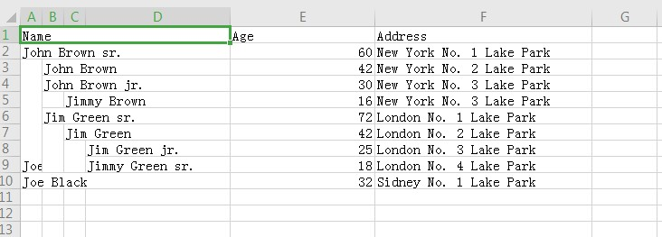
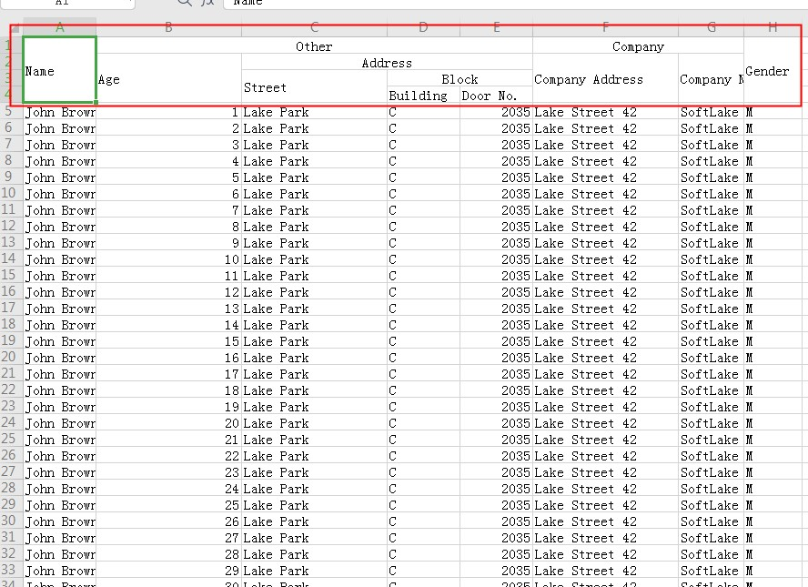

excel-exporter依赖excel.js能够和antd的table组件很好的配合使用，可以直接通过setColumns()和setDataSouce方便快速的导出excel文件

# dev
```bash
git clone https://github.com/chaomingd/excel-exporter.git

npm install

npm run start
```
# Dependency
```bash
npm install exceljs --save
npm install file-saver --save
```

# 简单使用
```javascript
import {
  ExcelExporter
} from 'excel-exporter'
const columns = [
  {
    title: '名称',
    dataIndex: 'name'
  },
  {
    title: '性别',
    dataIndex: 'sex'
  },
  {
    title: '住址',
    dataIndex: 'address',
    width: 30 // 注意这个宽度是指占多少个字符宽度，而不是px宽度 注意如果你在antd的table组件中使用了width属性，你不应该直接将columns给excelExporter处理，你需要将width属性重写为适当的值,不然会导致生成的excel单元格很宽
  }
]
const dataSource = [
  {
    name: '小明',
    sex: '男',
    address: 'xxxxxxxxxxxxx'
  },
  {
    name: '小明',
    sex: '男',
    address: 'xxxxxxxxxxxxx'
  },
  {
    name: '小明',
    sex: '男',
    address: 'xxxxxxxxxxxxx'
  }
]
const excelExporter = new ExcelExporter({
  sheetName: '人员信息'
})
excelExporter.setColumns(columns)
excelExporter.setDataSource(dataSource)
excelExporter.exportFile('人员信息', () => {
  console.log('完成') // 注意在弹出下载框点击保存和取消都会触发
})
```

## 支持树形结构


```js
import {
  ExcelExporter
} from 'excel-exporter'
const columns = [
  {
    title: 'Name',
    dataIndex: 'name',
    key: 'name',
  },
  {
    title: 'Age',
    dataIndex: 'age',
    key: 'age',
    width: '12%',
  },
  {
    title: 'Address',
    dataIndex: 'address',
    width: '30%',
    key: 'address',
  },
];
const data = [
  {
    key: 1,
    name: 'John Brown sr.',
    age: 60,
    address: 'New York No. 1 Lake Park',
    children: [
      {
        key: 11,
        name: 'John Brown',
        age: 42,
        address: 'New York No. 2 Lake Park',
      },
      {
        key: 12,
        name: 'John Brown jr.',
        age: 30,
        address: 'New York No. 3 Lake Park',
        children: [
          {
            key: 121,
            name: 'Jimmy Brown',
            age: 16,
            address: 'New York No. 3 Lake Park',
          },
        ],
      },
      {
        key: 13,
        name: 'Jim Green sr.',
        age: 72,
        address: 'London No. 1 Lake Park',
        children: [
          {
            key: 131,
            name: 'Jim Green',
            age: 42,
            address: 'London No. 2 Lake Park',
            children: [
              {
                key: 1311,
                name: 'Jim Green jr.',
                age: 25,
                address: 'London No. 3 Lake Park',
              },
              {
                key: 1312,
                name: 'Jimmy Green sr.',
                age: 18,
                address: 'London No. 4 Lake Park',
              },
            ],
          },
        ],
      },
    ],
  },
  {
    key: 2,
    name: 'Joe Black',
    age: 32,
    address: 'Sidney No. 1 Lake Park',
  },
];
const excelExporter = new ExcelExporter({
  sheetName: '人员信息'
})
excelExporter.setColumns(columns)
excelExporter.setDataSource(dataSource, {
    childrenColumnName: 'children', // 树形结构时子级的属性
    indentSize: 3 // 树结构时缩进的字符宽度
})
excelExporter.exportFile('人员信息', () => {
  console.log('完成') // 注意在弹出下载框点击保存和取消都会触发
})
```

# 支持表头分组

```javascript
import {
  ExcelExporter
} from 'excel-exporter'
const columns = [
  {
    title: 'Name',
    dataIndex: 'name',
    width: 10
  },
  {
    title: 'Other',
    children: [
      {
        title: 'Age',
        dataIndex: 'age',
        width: 20
      },
      {
        title: 'Address',
        children: [
          {
            title: 'Street',
            dataIndex: 'street',
            width: 20
          },
          {
            title: 'Block',
            children: [
              {
                title: 'Building',
                dataIndex: 'building',
                width: 10
              },
              {
                title: 'Door No.',
                dataIndex: 'number',
                width: 10
              }
            ],
          },
        ]
      }
    ]
  },
  {
    title: 'Company',
    children: [
      {
        title: 'Company Address',
        dataIndex: 'companyAddress',
        width: 20
      },
      {
        title: 'Company Name',
        dataIndex: 'companyName',
      }
    ]
  },
  {
    title: 'Gender',
    dataIndex: 'gender',
    key: 'gender',
    width: 8
  }
];
const data = [];
for (let i = 0; i < 100; i++) {
  data.push({
    key: i,
    name: 'John Brown',
    age: i + 1,
    street: 'Lake Park',
    building: 'C',
    number: 2035,
    companyAddress: 'Lake Street 42',
    companyName: 'SoftLake Co',
    gender: 'M',
  })
}
const excelExporter = new ExcelExporter({
  sheetName: '人员信息'
})
excelExporter.setColumns(columns)
excelExporter.setDataSource(data)
excelExporter.exportFile('人员信息', () => {
  console.log('完成')
})
```


# API

## 1. 配置

```javascript
const config = {
  sheetName: '人员信息'
}
const excelExporter = new ExcelExporter(config)
```

| 属性      | 描述         | 默认值    |
| --------- | ------------ | --------- |
| sheetName | 工作表的名称 | undefined |

## 2. 属性

| 属性                | 描述                                                         | 类型              | 默认值   |
| ------------------- | ------------------------------------------------------------ | ----------------- | -------- |
| workbook            | 工作簿对象 （excel.js中的WorkBook对象）const workbook = new  [ExcelJS.Workbook](https://github.com/exceljs/exceljs/blob/HEAD/README_zh.md#%E5%88%9B%E5%BB%BA%E5%B7%A5%E4%BD%9C%E7%B0%BF)(); | ExcelJS.Workbook  |          |
| worksheet           | 工作表对象 workbook.[addWorksheet](https://github.com/exceljs/exceljs/blob/HEAD/README_zh.md#%E6%B7%BB%E5%8A%A0%E5%B7%A5%E4%BD%9C%E8%A1%A8)(sheetName); | ExcelJS.WorkSheet |          |
| _columns            | setColumns方法处理过后的columns                              | IColumn[]         | []       |
| _dataSource         | setDataSource方法处理过后的dataSource                        | IDataSource[]     | []       |
| _childrenColumnName | 树形结构时子级的属性                                         | string            | children |
| _indentSize         | 树结构时缩进的宽度 (默认缩进3个字符)                         | number            | 3        |

```javascript
// 设置工作簿属性  // 详情请参考https://github.com/exceljs/exceljs/blob/HEAD/README_zh.md#%E5%88%9B%E5%BB%BA%E5%B7%A5%E4%BD%9C%E7%B0%BF
const workbook = excelExporter.workbook
workbook.creator = 'Me';
workbook.lastModifiedBy = 'Her';
workbook.created = new Date(1985, 8, 30);
workbook.modified = new Date();
workbook.lastPrinted = new Date(2016, 9, 27);
// 将工作簿日期设置为 1904 年日期系统
workbook.properties.date1904 = true;
```

## 方法

| 属性          | 描述                               | 类型                                                         | 默认值 |
| ------------- | ---------------------------------- | ------------------------------------------------------------ | ------ |
| setColumns    | 设置列 同antd table Columns        | (columns: IColumns[]) => void 后面详细介绍IColumn            | -      |
| setDataSource | 设置数据源 同antd table dataSource | (data:  IdataSource, options?: IdataSourceOption) => void 后面详细介绍 | -      |
| exportFile    | 将数据导出excel文件                | (filename: string, done) => void                             | -      |
| dispose       | 清理                               | function                                                     |        |

### IColumn 列类型

数据列对象是columns中的一项

| 属性      | 描述                                                         | 类型   | 默认值 |
| --------- | ------------------------------------------------------------ | ------ | ------ |
| title     | 列头显示文字                                                 | string | -      |
| dataIndex | 列数据在数据项中对应的 key，支持 `a.b.c` 的嵌套写法          | string | -      |
| style     | 列头单元格的样式 {  numFmt, font, alignment, border, fille  } 具体设置参考excel.js [样式](https://github.com/exceljs/exceljs/blob/HEAD/README_zh.md#%E6%A0%B7%E5%BC%8F) | object | -      |
| colStyle  | 一列的单元格样式 {  numFmt, font, alignment, border, fille  } 具体设置参考excel.js [样式](https://github.com/exceljs/exceljs/blob/HEAD/README_zh.md#%E6%A0%B7%E5%BC%8F) | object | -      |
| width     | 设置列的宽度， 单位不是px， 是占的字符个数，                 | number | -      |

### IdataSourceOption 设置数据源时如果是树形结构的表格 则可以设置缩进

| 属性               | 描述                   | 类型   | 默认值     |
| ------------------ | ---------------------- | ------ | ---------- |
| childrenColumnName | 树形结构时子级的属性   | string | 'children' |
| indentSize         | 树结构时缩进的字符宽度 | number | 3          |

